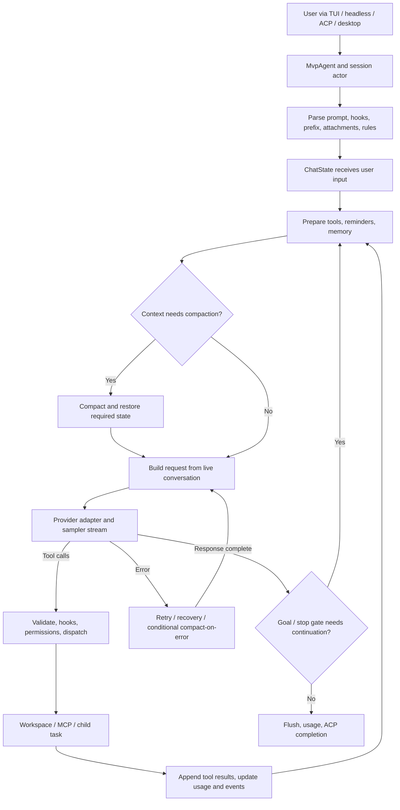
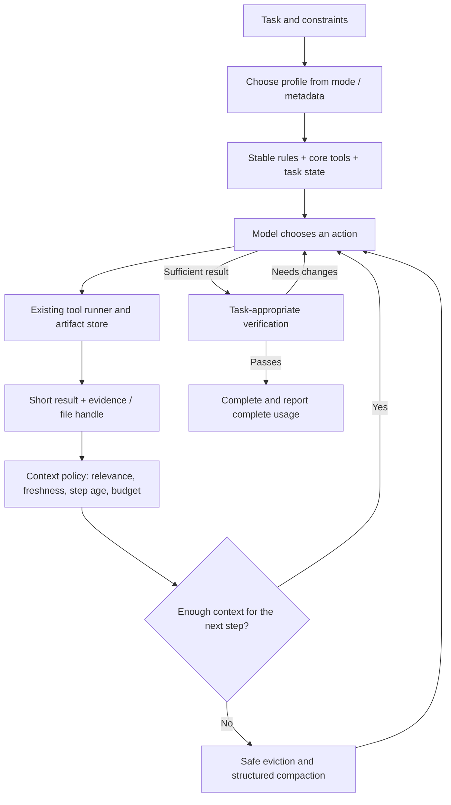

# Current core agent flow and token optimization

Review date: **2026-09-21**. Code revision: `f26bad444d1e8221baf006a485abc8d3adc42678`.
Scope: the core runtime shared by the TUI, headless mode, ACP, and desktop; the focus is the coding harness, context, and inference cost. The repository map is [ARCHITECTURE.md](../ARCHITECTURE.md).

This is a code analysis and design proposal, **not a benchmark result or a runtime change**. It does not inspect chat history, credentials, or private configuration under `~/.cook`; therefore it cannot identify the largest token source in a real user session. Values marked as proposals are starting points for experiments, not existing configuration.

## 1. Conclusion and priorities

**The current flow is a capable coding-harness foundation, but there is not enough evidence to call it cost-optimal; the code shows several concrete opportunities to improve it.** The `model → tools → model` loop is appropriate. The best direction is to keep the current runtime and add measured context and budget policies rather than rewriting the actor architecture or introducing a coordinator for every request.

Priorities:

1. **Measure cost by call type and request component.** Reuse the existing usage ledger and separate the main loop, compaction, goal roles, children, retries, and background helpers. Missing usage must remain visible as missing data.
2. **Reduce output retained during a long coding turn.** Pruning currently uses `User`-item age; many tool rounds inside one prompt are not aged according to the actual evidence lifecycle.
3. **Tighten the skill catalog budget and audit built-in schemas.** Lazy MCP discovery already exists. Skill listing already has a budget, but its default ceiling is large; catalogs should not be assumed to be small.
4. **Evaluate two-pass compaction by cost and latency.** The runtime feature defaults to enabled even though the portable policy default is disabled. Prefire can spend inference tokens when its summary is never used.
5. **Keep prefixes stable, select only needed context, and use goals/subagents according to task type.** The aim is to reduce rereads and rework, not only the token count of one request.

In this document, “optimal” means **the lowest cost per correctly completed task at an acceptable latency**, selected through model/provider benchmarks. No single compaction threshold or reasoning effort is optimal for every backend.

## 2. Structure and responsibilities

The paths below follow the four pillars in `ARCHITECTURE.md`; the UI is not the primary place to implement token policy.

| Component | Responsibility in the flow | Main places to inspect/change |
|---|---|---|
| `xai-grok-pager`, desktop | Accept input, send ACP, render streams/usage | `pager/src/app/`, `frontend/apps/let-cook/` |
| `xai-grok-shell` | Session lifecycle, turn loop, goals, tool orchestration, compaction | [run_loop.rs](../crates/codegen/xai-grok-shell/src/session/acp_session_impl/run_loop.rs), [turn.rs](../crates/codegen/xai-grok-shell/src/session/acp_session_impl/turn.rs) |
| `xai-grok-agent` | Agent definition, prompts, tools, policies | [context.rs](../crates/codegen/xai-grok-agent/src/prompt/context.rs), [compaction.rs](../crates/codegen/xai-grok-agent/src/compaction.rs) |
| `xai-chat-state` | Live conversation, request projection, token state, usage ledger | [request_builder.rs](../crates/codegen/xai-chat-state/src/actor/request_builder.rs), [usage.rs](../crates/codegen/xai-chat-state/src/usage.rs) |
| `xai-grok-sampler` / `sampling-types` | HTTP, streaming, retries, conversation-to-wire conversion | [client.rs](../crates/codegen/xai-grok-sampler/src/client.rs), [conversation/](../crates/codegen/xai-grok-sampling-types/src/conversation/) |
| `xai-grok-tools` / `xai-tool-runtime` | Registry, schemas, dispatch, and implementations | [registry/types.rs](../crates/codegen/xai-grok-tools/src/registry/types.rs), [tool_calls.rs](../crates/codegen/xai-grok-shell/src/session/acp_session_impl/tool_calls.rs) |
| `xai-grok-workspace` | Filesystem, processes, permissions, VCS, checkpoints/worktrees | [workspace_ops.rs](../crates/codegen/xai-grok-workspace/src/workspace_ops.rs) |
| Compaction / memory / subagents | Continue long tasks and split work | [compaction.rs](../crates/codegen/xai-grok-shell/src/session/compaction.rs), [subagent/handle_request.rs](../crates/codegen/xai-grok-shell/src/agent/subagent/handle_request.rs) |

The session actor runs on its own OS thread with a current-thread Tokio runtime. The sampler and chat-state also have actors for their respective responsibilities. These layers provide concurrency, cancellation, and ownership; actor count is not LLM call count. The session event log is canonical storage; SQLite provides derived indexes and state rather than replacing the conversation record.

## 3. Current flow from input to completion

### 3.1 Overview



The diagram omits cancellation, refusal, and fatal-error branches; those can terminate without another model call. Two-pass prefire runs in the background before the compaction threshold, rather than only in the “yes” branch. Tool notifications can reach the UI while a tool is running; UI streaming does not itself create an inference call.

### 3.2 Session startup

`MvpAgent` receives ACP messages and resolves the model/provider, workspace, agent definition, MCP, trust, and context. [spawn.rs](../crates/codegen/xai-grok-shell/src/session/acp_session_impl/spawn.rs) builds the `Agent`, `ToolContext`, `ChatState`, compaction policy, and reminder policy, then starts the session actor. [run_loop.rs](../crates/codegen/xai-grok-shell/src/session/acp_session_impl/run_loop.rs) multiplexes commands, state events, and session events.

Effective configuration can come from user settings, managed/requirements layers, remote settings, and model metadata. Follow **resolver → spawn parameters → runtime policy**; reading a struct’s `Default` alone is not enough to determine product behavior.

### 3.3 Initial prompt and context construction

[prompt_build.rs](../crates/codegen/xai-grok-shell/src/session/acp_session_impl/prompt_build.rs) handles the system prompt, resumed history, and first-user prefix. Depending on the template/profile, context can include the OS, shell, cwd, date, VCS status, workspace/user rules, skills, and MCP server listings. `PromptContext` also carries role/persona and memory capabilities. The child audience uses a smaller template and omits persona/subagent catalogs.

Not every block is appended on every round. Some are added only at startup, after a state change, or after compaction; **if they remain in history, they still enter later requests**. Distinguish “injected once” from “charged as input only once.”

An oversized user prompt is handled by [prompt_offload.rs](../crates/codegen/xai-grok-shell/src/session/acp_session_impl/prompt_offload.rs): the full text is written to `prompts/prompt_{n}.txt`, while the model receives a bounded head/tail excerpt and instructions for rereading. The threshold is `READ_FILE_MAX_TOKENS × BYTES_PER_TOKEN`, currently `25,000 × 4 = 100,000 bytes`. This is a byte estimate, not the provider’s exact tokenizer. If persistence fails, the model receives a missing-content warning and must not assume the full prompt exists.

### 3.4 Two nested loops

In [turn.rs](../crates/codegen/xai-grok-shell/src/session/acp_session_impl/turn.rs):

- The **outer loop** coordinates rounds, goal continuation, queued user input, and stop-hook feedback. A “final” response does not necessarily end the whole goal.
- The **inner loop**, `process_conversation_turn_inner`, prepares tool definitions, handles stationarity, drains interjections at safe points, injects conditional reminders, checks compaction, builds a request, and calls the sampler.
- The response’s usage and conversation items are recorded. When tool calls exist, the runtime executes them and uses their results as input for the next sample. Even without tool calls, structured-output, TodoGate, goal verification, and stop-hook gates can create more work.

Consequently, one submitted prompt can produce many model calls beyond the tool rounds visible in the UI.

### 3.5 Tools and dispatch

[sampler_turn.rs](../crates/codegen/xai-grok-shell/src/session/acp_session_impl/sampler_turn.rs), through `prepare_tool_definitions_inner`, obtains `tool_definitions_builtins_only()` and filters them for plan mode. MCP has discovery and call tools; **the main request does not initially include every MCP schema**. The registry currently distinguishes built-ins from MCP tools with a name-contains-`__` heuristic; the source has a TODO to use namespace metadata.

After projection for the backend, child, and structured-output mode, `effective_tools` is included in each request. Installed registry size is not the size of the toolset actually sent; measure after projection. `grok_build`, `codex`, and `opencode` are tool profiles/implementations; the existence of all three does not mean all three are sent together.

[tool_calls.rs](../crates/codegen/xai-grok-shell/src/session/acp_session_impl/tool_calls.rs) prepares and validates calls, applies approvals/hooks, locks paths related to writes, and uses `FuturesUnordered` to run calls. [tool_dispatch.rs](../crates/codegen/xai-grok-shell/src/session/acp_session_impl/tool_dispatch.rs) calls `WorkspaceOps::call_tool` through the tool runtime/Computer Hub.

Concurrency already exists. Further optimization should batch independent reads, cap total batch output, and avoid conflicting operations with dependencies. A path lock derived from arguments is not a complete analysis of every side effect of a shell command.

### 3.6 Request projection and provider

[request_builder.rs](../crates/codegen/xai-chat-state/src/actor/request_builder.rs) performs:

1. Upsert a memory reminder when required; it may persist the reminder into the system item.
2. Clone the live conversation and apply the image budget.
3. Prune tool results on the request copy when eligible.
4. Convert through `ModelRequestHistory` to create model history; the handler has already performed integrity repair before the clone.
5. Package items, tools, and sampling configuration as a `ConversationRequest`.

The shell adds metadata, hosted tools, output budgets, structured output, and image stripping for models declared text-only. The sampler maps the request to Chat Completions, Responses, or Messages. Rust serialization and HTTP compression change transport, not the number of semantic tokens the model must read.

Caching is handled in the adapters:

- [Responses mapping](../crates/codegen/xai-grok-sampling-types/src/conversation/responses.rs): `prompt_cache_key` falls back to the conversation ID; `previous_response_id` is currently `None`, and input is built from current items. Reasoning/backend item order is preserved for replay.
- [Messages mapping](../crates/codegen/xai-grok-sampling-types/src/conversation/messages.rs): cache breakpoints are marked in the system and transcript; thinking blocks that cannot carry a breakpoint are skipped.
- [Memory helper](../crates/codegen/xai-grok-shell/src/session/helpers/memory_context.rs): a persisted memory-context block is reused so re-search/re-scoring does not continually change the prefix.

This proves adapter support, **not actual cache hits**. Hits depend on the provider, backend, prefix, retention window, and endpoint. Re-sending history is not inherently a bug; it is a normal stateless-conversation implementation.

### 3.7 Recovery and completion

The sampler has its own retry layer; the shell can resubmit transient failures after sampler recovery is exhausted. Current constants in `sampler_turn.rs` allow up to 3 transient resubmits per step, 10 per prompt, and a 10-minute recovery episode, subject to error type, mode, and feature gates. These are **not** the system-wide maximum HTTP attempts. Auth, rate limits, context overflow, and output length have separate branches.

The runtime also has stationarity detection for repeated tool calls, doom-loop recovery, continuation after cut-off output, and a tool-call salvage streak cap. These avoid premature failure but can increase cost when the model/provider repeatedly returns incomplete responses.

Completion records conversation/events, flushes storage, records usage, and sends ACP completion. Live subagents and usage that has not yet arrived have separate semantics; UI usage cannot automatically be treated as a complete invoice.

### 3.8 Compaction is a separate inference flow

[compaction.rs](../crates/codegen/xai-grok-shell/src/session/compaction.rs) checks estimated usage from reported model totals plus newly added context. It also handles preflight overflow, compact-on-error, and compaction after a model switch when the new window is too small. Auto-compaction has failure-specific suppression; manual compaction does not use the same gate.

Single-pass compaction prepares history, a summary prompt, model/tools, and a budget, then calls [generate_session_compact](../crates/codegen/xai-grok-shell/src/session/helpers/session_compact.rs). The `compaction_verbatim_input` feature defaults to enabled in the registry: it prefers verbatim history, while fitting/retry can fall back to a shortened input. Do not assume the summarizer receives only a few lines or no tool schema. The code reserves 32,768 tokens for the compaction prompt/summary/reasoning; this is a compaction reserve, not the general output reserve for every main-loop request.

When two-pass is enabled, pass 1 snapshots a prefix, summarizes it in the background, and stores NOTE₁ with a fingerprint, model, and boundary. When compaction is needed, pass 2 uses the note and tail if the prefix is still valid; if pass 1 is still running, it can await the task handle. A changed prefix or model invalidates the note. Fallback branches retain the single-pass path.

After compaction, the runtime replaces active history with the compact result and required state, creates artifacts according to the selected mode, and rebuilds reminders for tasks/TODOs, rules, skills, MCP, and memory. A pre-compaction memory flush runs only when the policy and memory mode allow it; it is not mandatory for every compaction. Canonical history/artifacts and model-visible history serve different purposes: shortening a request does not delete source evidence.

## 4. Existing budgets and token-saving mechanisms

| Mechanism | Code-verified value/behavior | Consequence |
|---|---|---|
| Request pruning | Runs only when tracked `total_tokens > context_window / 2`; enabled by default | A fullness guard, not a per-step cost budget |
| Tool-result age | Counts backward through `ConversationItem::User`; keeps the last 3 turns | A prompt with many tool rounds can retain output for a long time; synthetic users affect counting |
| Soft trim | Old result over 4,000 characters → 1,500-character head + 1,500-character tail | Smaller context, but an error in the middle of a log may disappear |
| Hard clear | Age ≥10 turns → placeholder | Retained history also has eager pruning when a new user turn arrives |
| Read file | Cap of 25,000 **estimated** tokens and `MAX_LINES_READ = 1,000`, plus output-byte settings | One large read can materially grow context; over-cap reads can suggest narrower ranges |
| Bash | Default model output is 20,000 characters; full logs have a path when truncated | Head/tail truncation and offload already exist |
| Skill catalog | Default fraction is 50% of context; fallback is a 400,000-character budget; each description + when-to-use is capped at 400 bytes | There is a budget, but the ceiling is wide; not every session uses it all |
| Skill template | Non-Cursor XML is budgeted; Cursor compatibility is verbatim | Audit by profile rather than generalizing from one template |
| Auto-compaction | Baseline threshold 85%, with resolver/override | Prevents window overflow, not minimum cost |
| Two-pass | Feature registry default is `true`; portable `CompactionPolicy::default()` is `false` | Runtime resolution passes `two_pass_enabled` into spawn |
| Prefire | Starts 10 percentage points before the threshold; baseline is about 75% when threshold is 85% | Background inference runs before compaction is strictly needed |
| Two-pass split | Prefix is about 95% of token weight; NOTE₁ is capped at 60,000 characters with tool-boundary adjustment | Pass 2 receives the note and tail; an extra call reduces blocking latency |
| Compaction storage | Default enum mode is `Segments`, with transcript/summary modes | Existing artifacts can be reread; no new transcript store is needed |
| Todo reminders | Nudge enabled by default; TodoGate disabled by default, cap 2 when enabled | Do not attribute every session’s cost to TodoGate |
| Prompt suggestion | Transcript cap 24,000 characters, 1,500 per message; default output 64 tokens | Small calls still count when the feature is enabled |

Additional sources: [PruningConfig](../crates/codegen/xai-chat-state/src/types.rs), [retained prune](../crates/codegen/xai-chat-state/src/actor/mutations.rs), [read_file](../crates/codegen/xai-grok-tools/src/implementations/grok_build/read_file/mod.rs), [bash](../crates/codegen/xai-grok-tools/src/implementations/grok_build/bash/mod.rs), [skill listing](../crates/codegen/xai-grok-tools/src/types/skill_discovery_tracker/listing.rs), [skill tracker](../crates/codegen/xai-grok-tools/src/types/skill_discovery_tracker/mod.rs), [user template](../crates/codegen/xai-grok-agent/src/prompt/user_message.rs), [feature registry](../crates/codegen/xai-grok-config-types/src/registry.rs), [two_pass.rs](../crates/codegen/xai-grok-shell/src/session/two_pass.rs), [compaction mode](../crates/codegen/xai-chat-state/src/compaction_mode.rs), [reminder policy](../crates/codegen/xai-grok-agent/src/system_reminder.rs), [prompt suggestion](../crates/codegen/xai-grok-shell/src/session/helpers/prompt_suggest.rs).

The table contains inspected defaults/code branches, not a dump of one session’s effective configuration. Bytes, characters, and tokens are not equivalent, especially for Vietnamese, JSON, and code. [Token estimator](../crates/codegen/xai-token-estimation/src/lib.rs) uses bytes/4; calibrate it against provider-reported usage.

## 5. Why a task can consume many tokens

### 5.1 Cumulative history cost

Let `P` be the initial prefix and schema, `d` the average history growth per round, and `n` the number of requests. Without pruning/compaction:

```text
Cumulative input ≈ n × P + d × n × (n − 1) / 2
```

Illustrative example, **not a Cook measurement**: `P = 12k`, `d = 3k`, `n = 20` gives about `810k input tokens`, although the final request is only about `69k`. Caching can reduce the price/latency of repeated portions; cumulative input must still be interpreted separately from context-window size.

A 10k-token output retained across the next 12 requests contributes about 120k input-token reads. If it is cached, the price increase differs from 120k uncached tokens. Optimization must therefore consider output size, retention time, and cache hits together.

### 5.2 Actionable findings

| Finding | Confidence | How to verify the real impact |
|---|---|---|
| User-item age does not reflect tool-round count inside one prompt | Confirmed behavior in `request_builder.rs` | Replay a task with 20–50 tool rounds and chart raw/result tokens per request |
| Skill catalog has a 50% ceiling and a large fallback | Confirmed constant/config path; actual usage unknown | Measure the final listing by profile, skill count, and first/steady request |
| Built-in definitions are sent in `effective_tools` on each call | Confirmed flow; largest schema unknown | Histogram post-projection tokens by tool and identify rarely used groups |
| Two-pass has prefire and invalidation | Confirmed flow; discarded spend unknown | Measure started/consumed/discarded/cancelled passes, tokens, and latency |
| Prefix changes can lose cache reuse | Code actively reduces this risk for memory/replay | Hash prefix blocks and correlate cache reads with change reasons |
| Some responses without usage are not marked incomplete | Explicit TODO in `record_response_token_usage` | Return `usage=None` from a provider/mock outside bounded-child/retry-only paths |
| Goals, children, recovery, and helpers can add calls | Code paths exist; activation is conditional | Classify purpose and link request/attempt/parent IDs |

There is not enough evidence to claim that the system prompt is the main culprit, that MCP always injects every schema, or that caching is unimplemented. Do not infer request token count from template source size: templates have branches/placeholders and toolsets depend on profile.

### 5.3 Goals and subagents

Goals have planner, verifier/classifier, strategist, summarizer, and continuation stages with separate gates/caps in [goal.rs](../crates/codegen/xai-grok-shell/src/session/acp_session_impl/goal.rs). A normal prompt does not necessarily run every role. For a small fix, a heavy orchestration flow may cost more than the coding itself; for a long task, verification can save rework.

Children have their own session/model/toolset. [Fork normalization](../crates/codegen/xai-grok-subagent-resolution/src/context.rs) removes repeated blocks, shortens the beginning, and retains recent context; `subagent/handle_request.rs` also has a **verbatim fork** path. Do not assume every child receives full history or a short context. Isolation and worktree behavior are resolved from the request/capability; every child does not necessarily get its own worktree.

Parallelism usually reduces waiting time, not total tokens. Count child input/output, parent handoff, and parent integration, while avoiding double-counting usage already folded into the parent ledger.

## 6. Proposed target flow



Keep the existing components and add a policy layer that builds **model-visible context** from the conversation, task state, and artifacts. Preserve source data in the audit/replay store. Run deterministic selection first; do not add an LLM summarizer after every tool result.

### 6.1 P0 — measure correctly before changing defaults

Extend the existing telemetry/ledger at request assembly and sampler completion; do not create a second accounting system:

| Group | Proposed fields |
|---|---|
| Identity | session, prompt, request, attempt, parent/child, model, backend, profile, effective feature flags |
| Purpose | main, compact-pass1, compact-pass2, compact-single, goal-planner/verifier/strategist/summary, suggestion, memory; retry as a separate dimension |
| Estimated input parts | system/rules, catalog, schema, user payload, tool results, assistant, reasoning replay, compact summary, images |
| Reported usage | input, cache-read, cache-write, output, reasoning; cost when reported or derived from a versioned price table |
| Outcome | calls/task, retry cause, compact count, reread volume, prefix changes, wall time, task result |
| Completeness | usage_missing, cost_missing, incomplete, live child, unaccounted side call |

[usage.rs](../crates/codegen/xai-chat-state/src/usage.rs) already has input/output/cache/reasoning/model-call totals, per-model ledgers, missing-cost, and incomplete semantics. Extend it only after auditing **every call site**, especially compaction/helpers that call a client directly; the existence of a ledger does not prove every side call reaches it.

`record_response_token_usage` currently leaves some `usage=None` responses unmarked as incomplete. Close that gap before using the UI total as a baseline. If the cost of a failed or cancelled stream is unknown, record “unknown,” not zero.

Normalized task cost:

```text
Cost(task) = Σ [fresh_input × rate_fresh
                + cache_read × rate_read
                + cache_write × rate_write
                + billed_output × rate_output] + tool/provider fees
```

The adapter must define whether buckets overlap. Do not add reasoning twice when it is already included in billed output. Do not add child usage twice when the parent total already folds it in. Context usage for overflow is a different metric from billable total tokens.

For profiling, prefer counts, hashes, and provenance; do not log full prompts or file content by default. Report both raw and uncached input per task, not only “tokens used.”

### 6.2 P1 — budget tool output and age by step

Extend `PruningConfig` with metadata such as `tool_round`, `last_referenced`, artifact handle, file content hash, and evidence type. Keep `User` turn age for compatibility, then add an upper bound on live tool-result tokens **within one turn**.

Starting values for a cost-conscious coding profile:

- Default tool output around **2–4k estimated tokens**, with range-based follow-up reads; total batch around **8–12k**.
- Recent raw-result budget around **8–16k**, favoring the latest **3–6 tool rounds** while staying within budget.
- Keep the active failure, patch-preparation snippets, latest verification result, and output from live processes. Do not evict data that still needs a reference merely because it is old.

These are experiment targets, not a global reduction of `READ_FILE_MAX_TOKENS`. Code reading needs fidelity, and a skill that explicitly requests a full read must not be silently cut. Full content must remain accessible, with a marker describing what was omitted.

A compact result should contain exit status, file/range or command, relevant diagnostics, truncation state, and artifact path. Build on the existing bash log, prompt offload, and compaction-segment mechanisms. A read cache, when introduced, should key on normalized path, range, and content hash; file changes must invalidate it. Do not memoize side-effecting shell/test commands as pure file reads.

Only replace the content of completed `ToolResult`s; preserve call IDs, role ordering, and a result for every call. Do not evict pending calls or data required to resume a process. Restoring a raw result through a handle must pass through the existing permission boundary.

Avoid rewriting many prefix positions on every sample: make output short at generation time, batch eviction at a hysteresis boundary, and measure the cache penalty. A smaller context that destroys the entire warm prefix can cost more.

### 6.3 P1 — smaller catalogs and profile-specific toolsets

Skill bodies are loaded on invocation; first tighten the **listing budget and selection**. An experiment can use a catalog budget of **1–2k tokens** or `min(absolute_cap, small_fraction × context_window)`, with search/discovery for hidden entries. Always surface a skill explicitly requested by the user; pin the active skill and preserve scope/precedence rules.

For built-in tools, audit the post-projection `effective_tools` and retain the read/search/run/edit and required control groups. Specialized capabilities such as media, workflows, and integrations should appear only when the profile needs them or discovery selects them. Do not rename the public tool API casually; use existing registry metadata and the bridge. Replacing the `__` heuristic with namespace metadata is a separate step with regression tests.

Prefer deterministic selection from mode, declared capabilities, and explicit user choice. An LLM classifier is not needed for every prompt. Keep toolset and ordering stable within a phase to avoid schema churn and cache misses. Models differ in how well they handle discovery layers, so benchmark by model.

### 6.4 P1/P2 — compaction based on benefit, with structured state

Keep the current overflow guard, but base the decision on the projected request:

```text
input_budget = context_window − reserved_output − safety_margin
projected_input + expected tool burst must fit inside input_budget
```

Reserve values depend on the backend: reasoning/output semantics and model limits differ. A bytes/4 estimate needs a safety margin and calibration; “15% of the window remains” is not always enough for reasoning plus a large tool batch.

The preferred order is: remove redundant output with an artifact → remove stale/duplicate reads → shrink optional catalogs → compact stable history. If mandatory rules plus the current input do not fit, report the problem and use a valid offload; do not silently cut user requirements.

Proposed summary schema: objective/constraints, repository state and changed files, active decisions, checks and results, unresolved failures, live task/process IDs, artifact references, and next steps. Keep literal evidence for important commands, paths, and errors; a summary must not turn “planned” into “completed.” Reuse `CompactionStateContext` and segments, extending the schema at the appropriate layer.

Benchmark two-pass on and off with the same task/model, measuring total cost and p95 compaction stall. For a cost-first profile, try **disabling speculative prefire** while retaining single-pass fallback; do not change the product-wide default before data. The existing experiment flag is `[features] two_pass_compaction = false`, but record the effective resolved value because policy layers can override it.

Prefire is worthwhile only when saved future input cost exceeds compaction cost, cache rebuild cost, and expected reread cost, using the backend’s actual cache prices. Add a cooldown after discarded passes, a minimum token-growth condition, and a prediction that the task will continue long enough. A cheaper summary model is a separate experiment; check recall and format and preserve reasoning/provider replay contracts.

### 6.5 P2 — reasoning, goals, and delegation by task

Keep one main coding agent as the default. Small tasks should run edit plus targeted verification. Long tasks can use goal orchestration; spawn children only for sufficiently independent work with an explicit handoff. A handoff should contain the objective, constraints, files, evidence references, and expected output; use a full fork only when history dependencies require it.

Task budgets must cover the parent, children, compaction, and recovery. Cap child output and total quota, but do not treat budget exhaustion as completion. Preserve the existing cancellation and pending-usage folding semantics.

Choose reasoning effort from model capability and task difficulty; measure low/medium/high by task class. Lower effort can increase tool retries and bad patches. Avoid changing models on every step: a switch can lose cache reuse, change history format, and trigger compaction.

The goal verifier should receive explicit evidence: requirements, diff, and test/command results with provenance. Rerun it after relevant changes or when prior evidence is incomplete; avoid repeating a verifier over unchanged data. Do not remove verification solely to reduce calls.

### 6.6 P2 — reduce loops that make no progress

Extend stationarity beyond “same tool + args” to action/result fingerprints: rereading the same file/range/hash, repeating an unchanged test failure without a code change, or repeating a search that yields no new evidence. The response should nudge a strategy change or stop with an evidence-backed blocker.

Polling a live job is an exception: use actual process/session state, notifications, or a timed wait; unchanged output does not prove a stall. Do not hard-stop a long build merely because `get_task_output` repeats.

## 7. Implementation plan by change map

| Phase | Change locations | Deliverable / completion condition |
|---|---|---|
| P0: baseline | `chat-state/usage.rs`, `shell/.../sampler_turn.rs`, sampler metrics, side-call helpers | One-task report with call purpose, actual/estimated usage, missing flags, and no child double-counting |
| P1a: output | `tools/.../bash`, `read_file`, truncate helpers, `shell/.../tool_calls.rs` | Compact output with full-output handles; errors and requested ranges preserve fidelity |
| P1b: context | `chat-state/types.rs`, `actor/request_builder.rs`, mutations, request-history validation | Step-aware pruning with budgets, pins, and provenance; replay/cancel/resume remain correct |
| P1c: catalog | Skill tracker/listing, agent user template, registry/bridge, sampler tool projection | Small budgeted catalog with discovery; profile-specific built-ins; tool IDs/permissions preserved |
| P2a: compaction | `shell/session/compaction.rs`, `two_pass.rs`, common compaction, helpers | Measure consumed/discarded prefire; structured summary; fit includes output reserve |
| P2b: orchestration | `goal.rs`, goal roles, subagent resolution, prompt-suggestion gates | Task budgets cover side calls; delegation/verification is evidence-driven |
| P3: rollout | Config registry, telemetry, UI usage presentation | Profile opt-in, staged rollout, and flag-based rollback |

Names such as `cost-conscious coding`, `tool_round`, `call purpose`, and `input_budget` are **proposals**, not claims that public config/API already exists. Do not edit the generated root `Cargo.toml`; core changes belong in shell/chat-state/tools, and desktop remains a leaf ACP client.

Recommended order: P0 → output and step-aware pruning → catalog → compaction policy → goal/model routing. Run each change as its own A/B experiment before combining arms, so regressions remain attributable.

## 8. Benchmark and decision criteria

### 8.1 Task set

Create roughly 30–50 fixed tasks divided into: one-file fixes, fixes with failing tests, repository exploration, multi-file refactors, tasks that exceed the context window, interjection/resume, MCP/skill, and goals with children. Include a large repository and Vietnamese/Unicode payloads. Use fixed repository snapshots/diffs/acceptance checks, permissions, and model parameters.

Run the baseline with the **effective configuration recorded**. Repeat each arm at least three times when inference is stochastic. Separate cold/warm cache, provider/backend, and model; do not average short and long tasks into one number. Record the benchmark budget and total spend; this document does not run paid model calls.

### 8.2 Arms and metrics

| Arm | Question |
|---|---|
| A: current | Where is current cost concentrated? |
| B: output + step pruning | How much cumulative history is removed, and does rereading increase or mid-log errors disappear? |
| C: catalog/schema budget | How much initial/steady input falls, and does tool/skill discovery fail? |
| D: single vs two-pass | Does it save money or only move latency into the background, and how much prefire is discarded? |
| E: combined best arms | Do gains survive cache and policy interactions? |

Primary metrics: **cost per accepted task**, requirement-level success rate, raw/uncached input, output/reasoning, calls by purpose, retries, reread tokens, p50/p95 wall time, compaction stall, and peak context. Failed runs remain in total spend; compare all runs, not only successful ones.

Experimental target, not a commitment: reduce cost per accepted task (total spend across all runs divided by accepted runs) by ≥20%, keep success-rate loss under 2 percentage points, and keep p95 latency increase under 10%. With a small sample, two percentage points may be below statistical resolution; report confidence intervals and expand the sample rather than claiming success from a few runs. Any regression in permissions, requirements, file/patch correctness, or false completion blocks rollout even if mean cost improves.

### 8.3 Regression checks for implementation

- A prompt with many tool rounds: pruning follows budget and keeps the latest failure and active-edit snippets.
- Tool call/result pairing, provider reasoning replay, structured output, and text-only image stripping remain valid.
- Errors in the middle of output remain recoverable; artifacts are readable after compaction/resume in the correct session scope.
- A file changed after a read: stale cache is not returned; read-after-write and required concurrent-tool ordering remain correct.
- A user changes the objective or interjects: new constraints override old snapshots; stale checkpoints cannot declare completion.
- Prefire after rewind/model switch/cancel: an invalid NOTE₁ is not applied; cancellation is not recorded as successful compaction.
- A live child or missing usage: totals do not double-count, incomplete is visible, and unknown usage is not treated as free.
- Synthetic users/reminders do not cause new evidence to be hard-cleared; live process polling is not mistaken for no progress.

Existing test seams to reuse: [chat-state actor tests](../crates/codegen/xai-chat-state/src/actor/tests.rs), [subagent usage fold tests](../crates/codegen/xai-grok-shell/src/session/acp_session_tests/subagent_usage_fold_tests.rs), [prefire tests](../crates/codegen/xai-grok-shell/src/session/compaction_two_pass_prefire_helper_tests.rs), [goal compaction reseed tests](../crates/codegen/xai-grok-shell/src/session/acp_session_tests/goal/goal_compaction_reseed_tests.rs), and [request mapping tests](../crates/codegen/xai-grok-sampling-types/src/conversation/responses_tests.rs).

Baseline commands for a later implementation pass, selecting filters appropriate to the change:

```sh
cargo test -p xai-chat-state --lib
cargo test -p xai-grok-sampling-types --lib
cargo test -p xai-grok-tools --lib skill_discovery_tracker
cargo test -p xai-grok-shell --lib compaction
cargo check -p xai-grok-shell -p xai-grok-pager -p xai-grok-sampling-types
```

These are validation plans, **not commands run while writing this document**. Unit tests verify invariants; they do not prove token savings or coding quality, which require a separate benchmark.

## 9. Directions not to prioritize first

Do not replace the actor runtime with another framework merely to reduce tokens: process layout does not shorten prompts. Do not increase the context window as the default cost solution; long history can still increase cumulative input. Do not enable multi-agent orchestration or an LLM router for every task. Do not run an LLM summarizer after every tool call; first use structured truncation and artifact retrieval.

Do not lower output/reasoning caps arbitrarily: continuation, retries, and rework can increase. Do not remove required AGENTS/rules/constraints to hit a token number. Do not compact repeatedly at a very low threshold without accounting for cache rebuild and information loss. Do not merge every tool into a vague “mega-tool” only to reduce the tool-name count.

## 10. External references and limits of the conclusion

The principles of sufficient context, just-in-time retrieval, and structured notes align with [Effective context engineering for AI agents](https://www.anthropic.com/engineering/effective-context-engineering-for-ai-agents). This is design guidance, not a Cook benchmark.

Keeping tool outputs short and clear and evaluating with real tasks are discussed in [Writing effective tools for AI agents](https://www.anthropic.com/engineering/writing-tools-for-agents). Lazy tool discovery is illustrated in [Introducing advanced tool use](https://www.anthropic.com/engineering/advanced-tool-use); Cook already has MCP discovery, so the proposal focuses on catalog budget and remaining built-ins. Vendor-reported savings are not projections for Cook.

Verified here: request/tool/response paths in source, important defaults and overrides, existing limits, request-pruning/cache mappings, and change seams. Not verified here: a user session’s rendered prompt, actual cache hits, billing allocation for side calls, quality after policy changes, or achieved savings. **The immediate engineering decision should be to add a baseline and then optimize output/context in long turns; changing defaults should wait for the benchmark arms above.**
